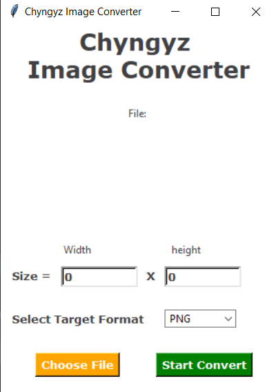
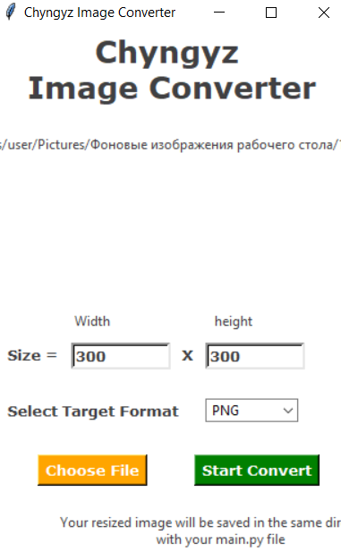
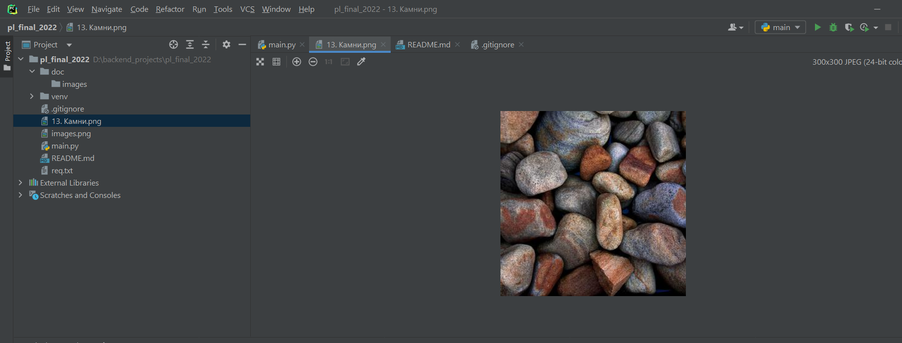

#  GUI for resizing photo

#### To try it you should
1. Create virtual environment
2. install packages from req.txt
3. run main.py file

### 1. Run main.py

### 2. Choose file and specify sizes you need

### 3. You can find resized file in same directory

